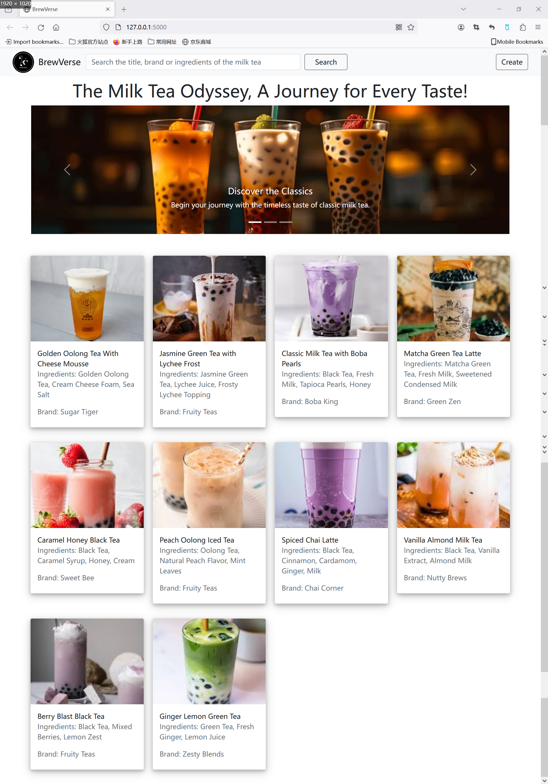
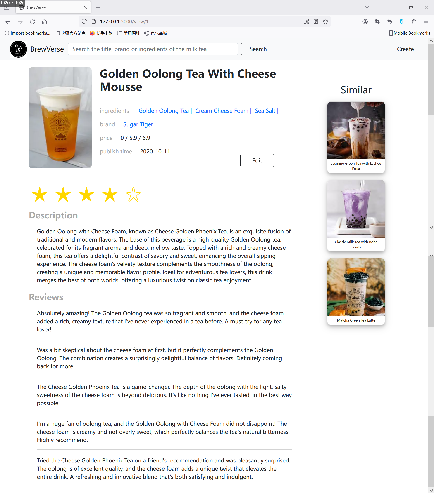
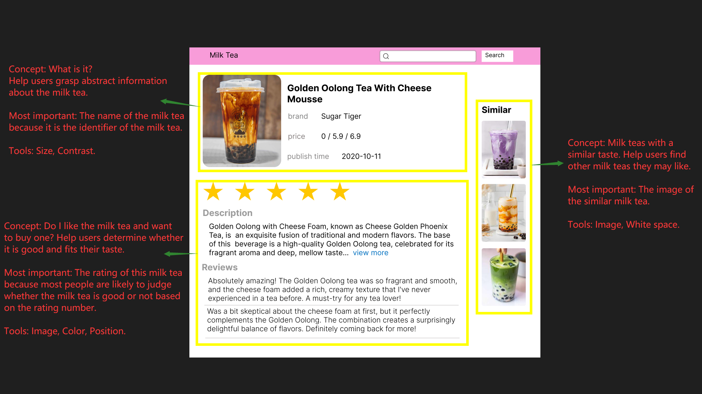
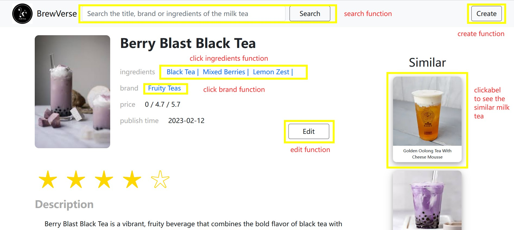
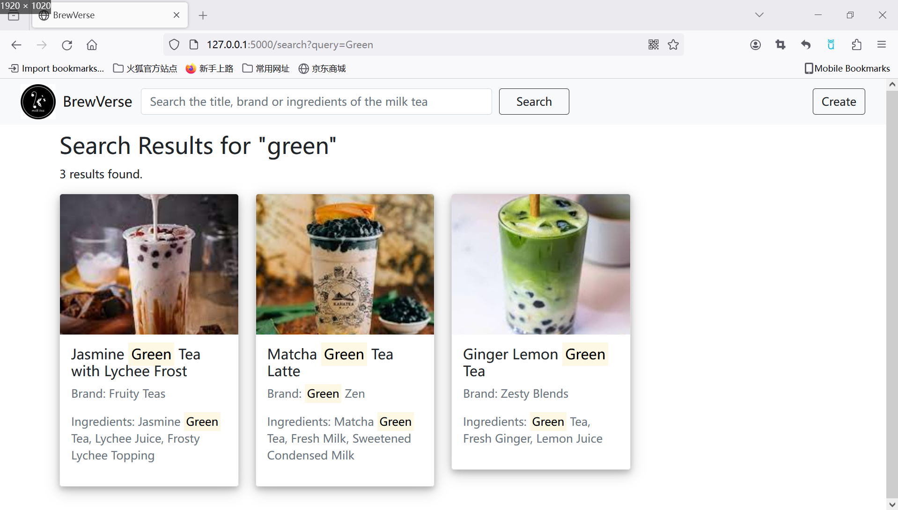
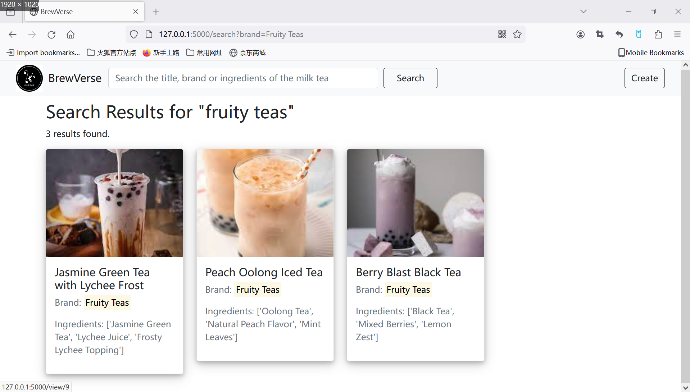
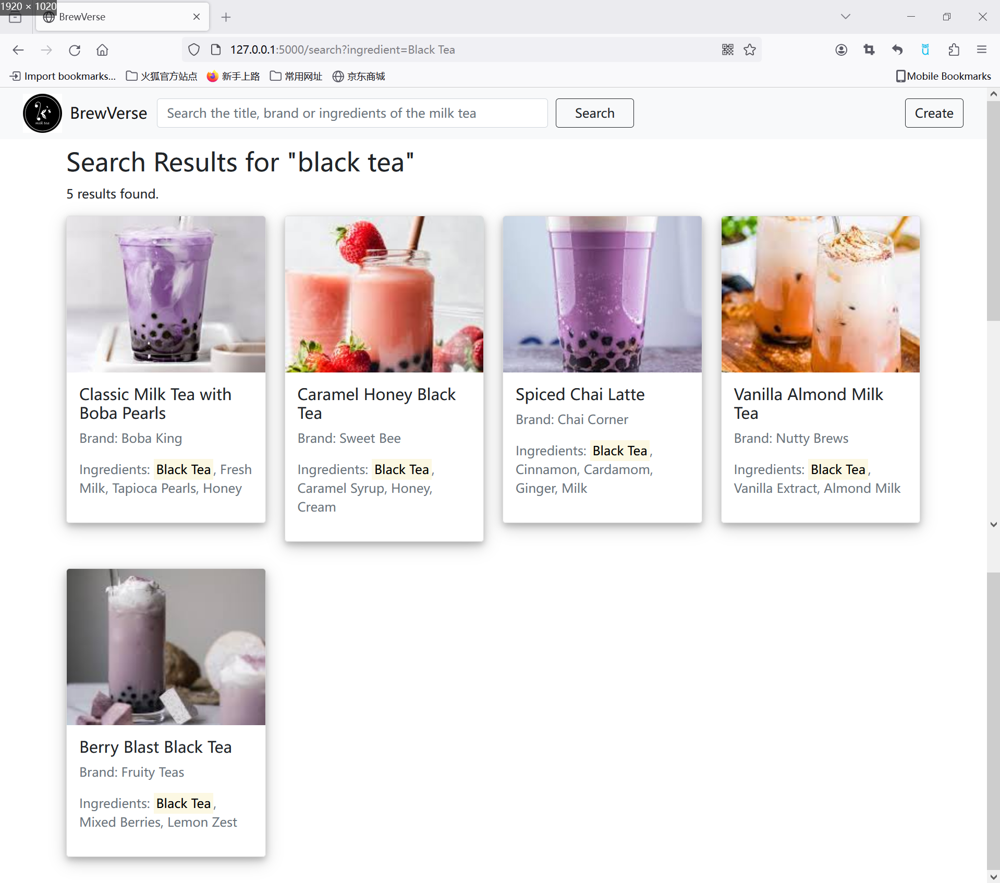
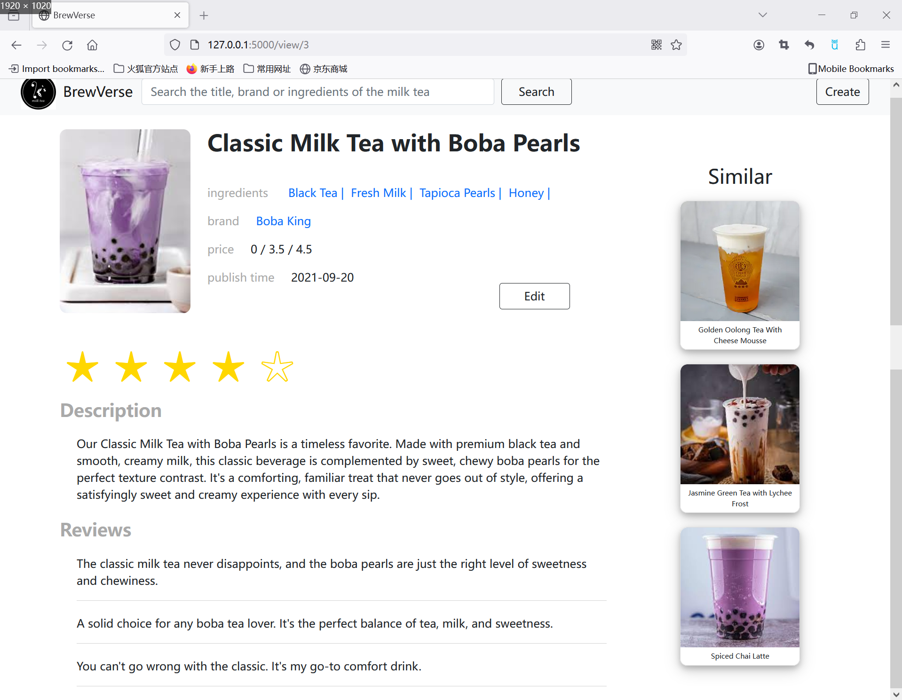
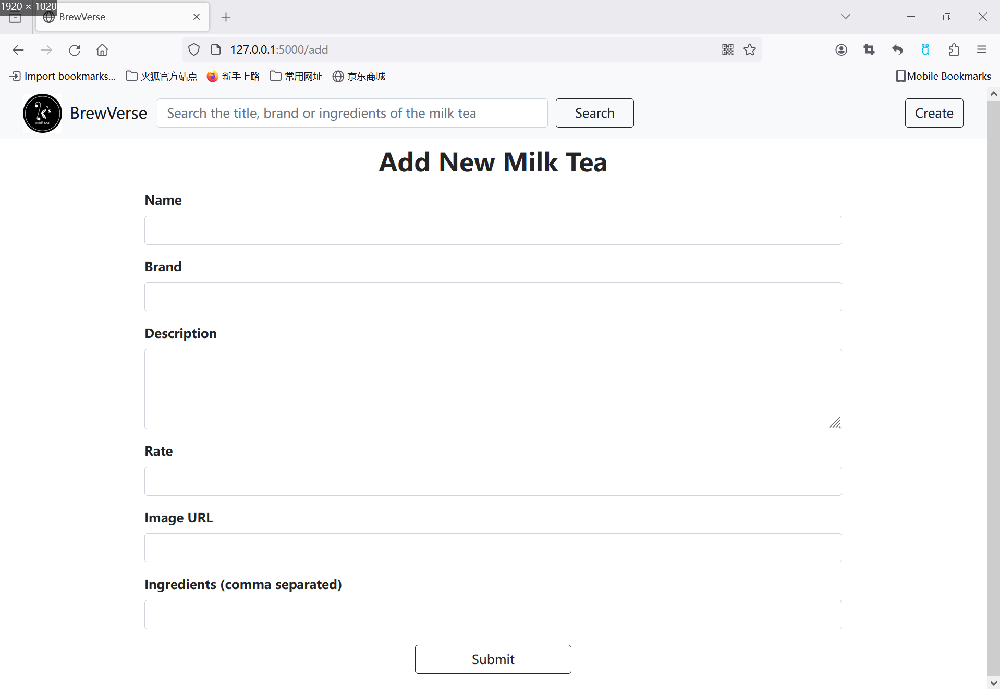
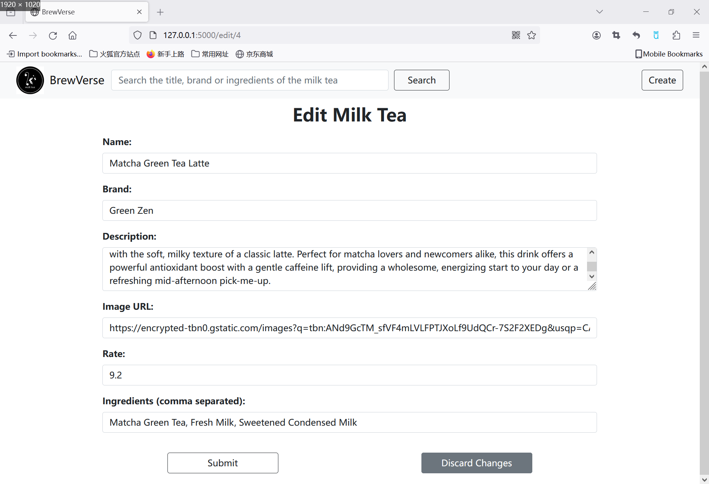

# BrewVerse: A Milk Tea Exploration Platform

Welcome to BrewVerse, the ultimate destination for milk tea enthusiasts! Whether you're a curious newcomer or a seasoned aficionado, our site offers an extensive collection of milk tea varieties waiting to be discovered. Perfect for anyone eager to dive into the diverse and rich world of milk tea.

## Built With

- [HTML](https://developer.mozilla.org/en-US/docs/Web/HTML) - The standard markup language for documents designed to be displayed in a web browser.
- [CSS](https://developer.mozilla.org/en-US/docs/Web/CSS) - A stylesheet language used to describe the presentation of a document written in HTML or XML.
- [JavaScript](https://developer.mozilla.org/en-US/docs/Web/JavaScript) - A programming language that enables interactive web pages.
- [jQuery](https://jquery.com/) - A fast, small, and feature-rich JavaScript library.
- [Bootstrap](https://getbootstrap.com/) - An open-source CSS framework directed at responsive, mobile-first front-end web development.
- [Flask](https://flask.palletsprojects.com/) - A lightweight WSGI web application framework for Python.

## Features

- **Explore Various Milk Teas**: Discover classic flavors and exotic blends from around the world.
- **User-Friendly Interface**: Easy navigation and accessible information.
- **Personalized Recommendations**: Get suggestions based on your taste and previous selections.(not implemented)

## Main Page

### Homepage

The homepage features a carousel to showcase the purpose and target audience of the site, and displays an array of milk teas available for exploration:



### View Page

The view page presents detailed information about a specific milk tea, organized into three conceptual groups, illustrating various UI design principles:




## Functionalities


Our platform offers several functionalities, including:

- **Search**: Users can search for milk teas using the search bar.
  

- **Explore**: Users can explore the milk tea by clicking brand and ingredients. In addition, user can click the similar milk tea to explore the details of a similar milk.
  
  
  

- **Create and Update**: You can update one milk item and edit one milk item's information by clicking the create and edit button.
  
  

Enjoy your journey through the diverse and delightful world of milk tea with BrewVerse!

## Getting Started

Follow these instructions to set up the project locally for development and testing purposes.

### Prerequisites

What you need to install the software:

- [Python](https://www.python.org/)
- [Flask](http://flask.pocoo.org/)

### Installation

1. Clone the repository:

   ```bash
   git clone https://github.com/qf2172/Front-end-for-BrewVerse.git
   ```

2. Navigate into the project directory:
   ```bash
   cd Front-end-for-BrewVerse
   ```
3. Install the required Python packages:
   ```bash
   pip install -r requirements.txt
   ```
4. Set the FLASK_APP environment variable:
   ```bash
   export FLASK_APP=app.py
   ```
5. Run the Flask application:
   ```bash
   flask run
   ```
